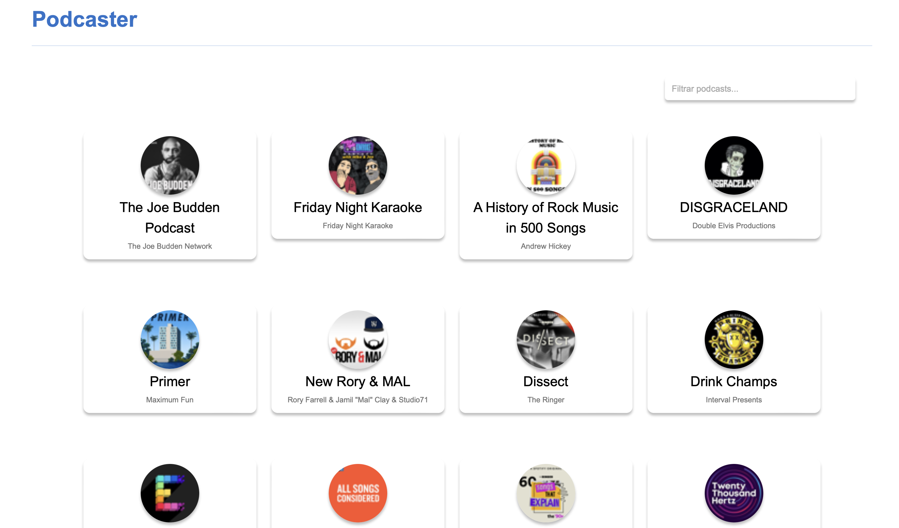
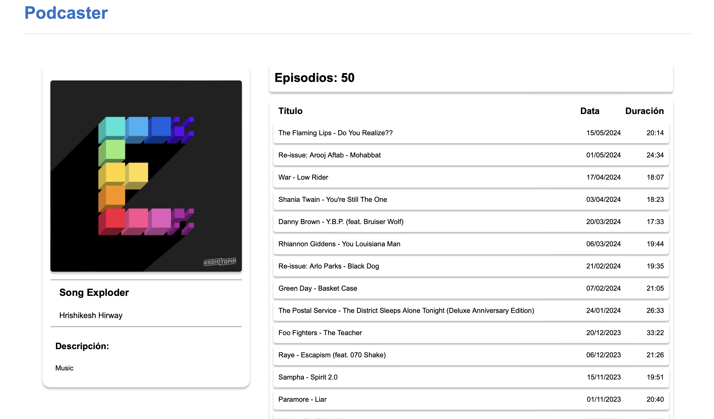
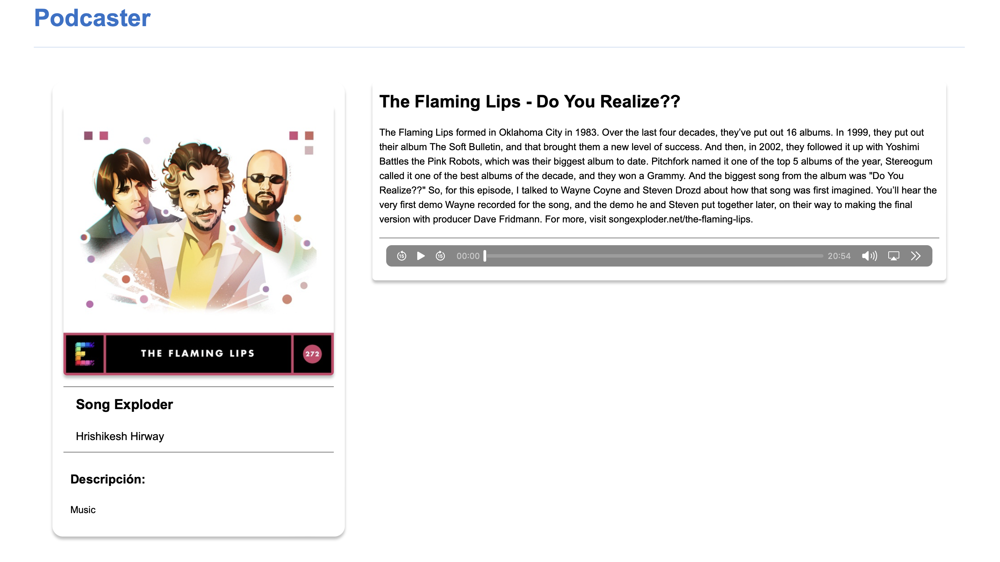

# Merlin Software
Prueba técnica front-end. Para ver el enunciaco de la prueba, abra el siguiente [pdf](assets/prueba%20técnica-front-end.pdf).

## Run

```
cd frontend
npm install (solo la primera vez)
npm start
```
## Resultados

### Página principal



### Detalle del podcast



### Detalle del episodio



### FeedBack

* Pagina Principal ->
    * Falta mantener el tamaño de las cards consistente para que no vayan bailando con los titulos
    * El filtrado no es inmediato, hace falta pulsar enter para que lo haga (Pero el filtrado en sí está bien aunque falta el numero de podcasts en pantalla)
    * Podría coger las imagenes hq del endpoint
    * Por lo demás bien


* Detalle del podcast ->
    * Estaría bien poner los títulos como links.
    * Hace la llamada al endpoint aunque guarde los datos en localstorage
    * Lo demás perfecto


* Detalle del episodio ->
    * En la card pone la imagen del episodio en vez del podcast (Pero sinceramente tiene más sentido así, no lo consideraría fallo)
    * Hace la llamada al endpoint aunque guarde los datos en localstorage
    * No parsea bien el HTML de la descripcion del episodio, y estaría bien que parseara los links como en el ejemplo.
    * Lo demás perfecto


* Misc ->
    * No hay loader en el header, pero hay uno en el body mientras no cargan los datos (No lo consideraría fallo)
    * Guarda los datos en localstorage pero en las pantallas de detalle del podcast y del episodio hace las llamadas igual aunque estén guardados los datos
    * Hace el fetch bien sin usar el proxy y sin que de error de CORS
      Por lo general bastante bien. Tiene fallitos pero en general se ciñe bastante al enunciado.


## Notas:

- Los estilos deberían estar en ```.css``` aparte, por simplificación, está todo junto.
- En esta versión, los estilos son aproximaciones.
- Hay algunos post que al obtener sus detalles me da el siguiente error:
```
Access to fetch at 'https://itunes.apple.com/lookup?id=1708275587' from origin
'http://localhost:3000' has been blocked by CORS policy: No 'Access-Control-Allow-Origin'
header is present on the requested resource. If an opaque response serves your needs,
set the request's mode to 'no-cors' to fetch the resource with CORS disabled.
```

```
GET https://itunes.apple.com/lookup?id=1708275587 net::ERR_FAILED 200 (OK)
```
- En caso de error en la obtención de datos, se notificará en la consola y se mostrará
un spinner en la interfáz de usuario.
